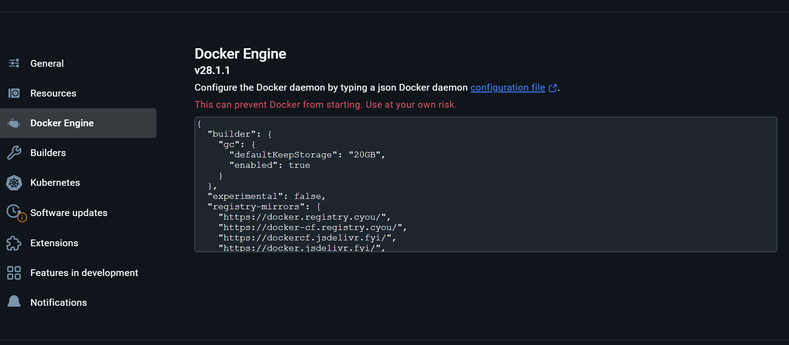
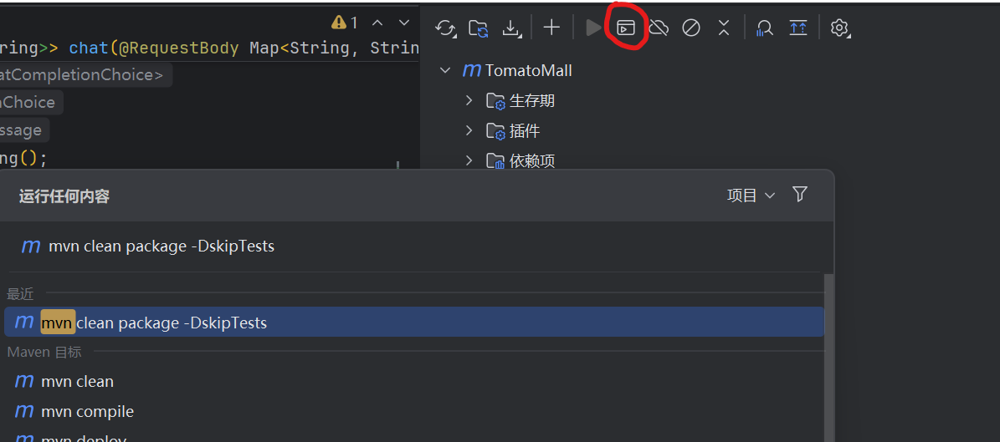
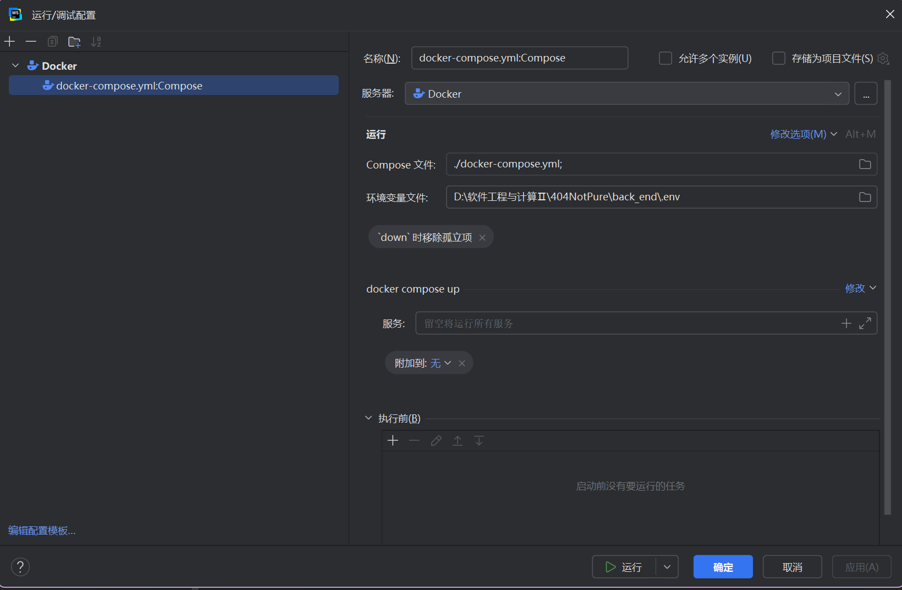
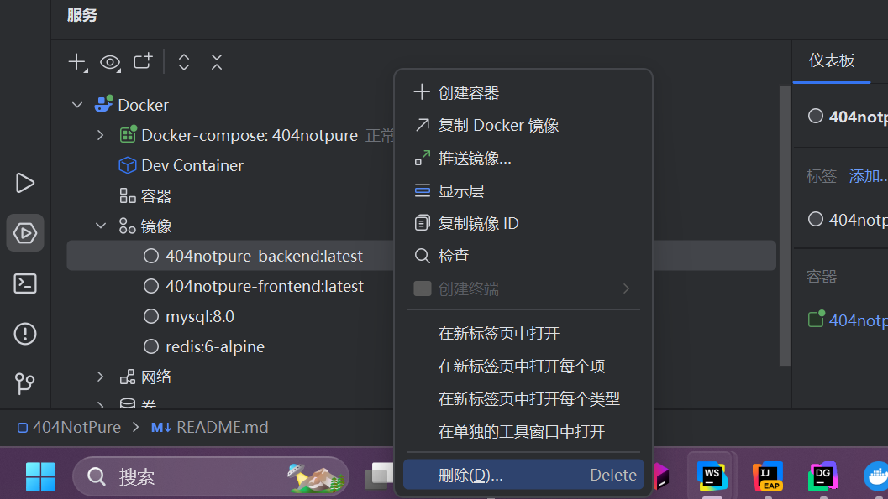
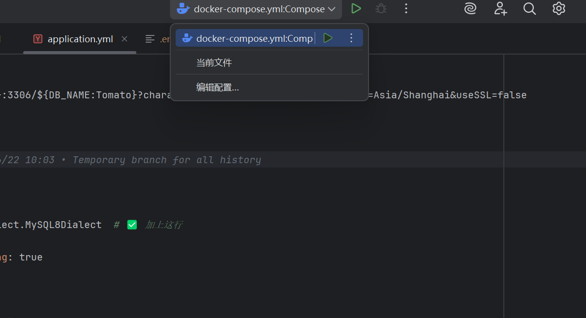
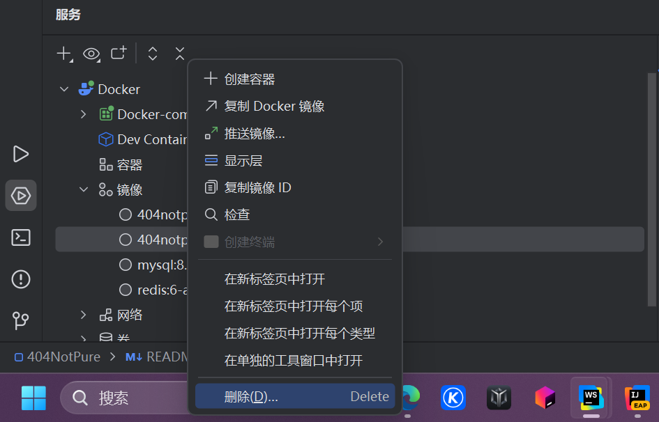

# 404NotPure
南京大学23届软工Ⅱ大作业

## 当前分支
main

## 配置

（默认后端使用IDEA打开，根目录用WebStorm打开）

### 前置

请先确保Docker desktop, MySQL, Natapp已启动

### Docker desktop配置



如图所示， 设置为
```json
{
  "builder": {
    "gc": {
      "defaultKeepStorage": "20GB",
      "enabled": true
    }
  },
  "experimental": false,
  "registry-mirrors": [
    "https://docker.registry.cyou/",
    "https://docker-cf.registry.cyou/",
    "https://dockercf.jsdelivr.fyi/",
    "https://docker.jsdelivr.fyi/",
    "https://dockertest.jsdelivr.fyi/",
    "https://mirror.aliyuncs.com/",
    "https://dockerproxy.com/",
    "https://mirror.baidubce.com/",
    "https://docker.m.daocloud.io/",
    "https://docker.nju.edu.cn/",
    "https://docker.mirrors.sjtug.sjtu.edu.cn/",
    "https://docker.mirrors.ustc.edu.cn/",
    "https://mirror.iscas.ac.cn/",
    "https://docker.rainbond.cc/",
    "https://jq794zz5.mirror.aliyuncs.com"
  ]
}
```

### 请到对应官网购买或注册使用相应服务，得到所需键值

* 阿里云
  * ALIYUN_OSS_ENDPOINT
  * ALIYUN_OSS_ACCESS_KEY_ID
  * ALIYUN_OSS_ACCESS_KEY_SECRET
  * ALIYUN_OSS_BUCKET_NAME

* 支付宝
  * ALIPAY_APP_ID
  * ALIPAY_APP_PUBLIC_KEY
  * ALIPAY_ALIPAY_PRIVATE_KEY
  * ALIPAY_NOTIFY_URL
  * ALIPAY_SERVER_URL
  * ALIPAY_RETURN_URL

* 豆包
  * ARK_API_KEY
  * ARK_MODEL

* DB（部分默认值请参考application.yml中的键值对）
  * DB_HOST
  * DB_PORT
  * DB_NAME
  * DB_USER
  * DB_PASSWORD

* Redis（默认值请参考application.yml中的键值对）
  * REDIS_HOST
  * REDIS_PORT

### Docker获取环境变量

* 请创建./backend/.env

* 在.env中添加设置以上所列出的键及其值

### 构建Docker-compose

* 在IDEA中右侧栏的maven中点击所⽰按钮，然后运⾏图中指令来构建.jar⽂件



* 在WebStorm中打开运行/调试配置构建镜像和容器



## 每次启动或修改代码必需动作

### 后端

1. 在IDEA中右侧栏的maven中点击所⽰按钮，然后运⾏图中指令来构建.jar⽂件


2. 在WebStorm中点击下方Service。再执行图示操作



3. 在WebStorm中执行图示操作



### 前端

仅修改依赖时需要重新构建，若只修改代码不需要以下步骤，浏览器会自动更新。

1. 在WebStorm中点击下方Service。再执行图示操作



2. 同后端3

## 注意事项

* 勿直接修改容器内⽂件：所有代码应通过 Git 同步，避免容器销毁后丢失。
* 谨慎操作数据库：禁⽌直接在⽣产环境容器中执⾏ DROP 或 TRUNCATE。
* 敏感信息保护：.env ⽂件不提交⾄ Git，使⽤ .gitignore 过滤。
* 遇到问题先自查⽂档 → 询问团队 → 联系维护⼈